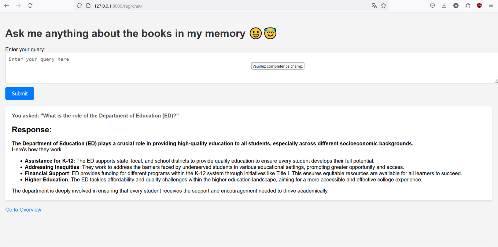

# Agentic Retrieval-Augmented Generation (RAG) System

This project is an agentic Retrieval-Augmented Generation (RAG) system that enhances users' interactions with PDF content by providing intelligent querying, contextual answers, and export options.

## Features
- **Upload PDF Files**: Users can upload multiple PDF files for processing.
- **Intelligent Querying**: Users can ask questions related to the content of the uploaded PDFs and receive relevant answers.
- **Contextual Awareness**: The system can identify whether a query is out of context, ensuring users get the most relevant responses.
- **Answer Export Options**: Users can save responses as a PDF or text file for enhanced usability and accessibility.
  
## How It Works
1. **Document Processing**: It fetches pdf files from Source_files folder, processes them and splits them into text chunks using the `Documents` and `Processing` modules.
2. **Embedding Generation**: Embeddings of these text chunks are calculated using the SentenceTransformer (`Embedding` module) and saved for future use.  It then saves a hashing of the files in the directory_hash.txt file to track changes in source files, if no change is noticed when the app is started, the RAG system works with the saved embeddings, else the embeddings are calculated and saved.
3. **Query Embedding and Retrieval**: When a user submits a query, the system calculates an embedding for the query and uses cosine similarity to retrieve the most relevant text chunks (`Retriever` module).
4. **Language Model Response**: The retrieved chunks and the user's query are sent to a Language Model (Gemma2 LLM) to generate a proper response (`LLMResponder` module). The response is then displayed to the user via Django.
5. **Export Options**: If requested, the response can be saved as a PDF or text file.

## Technologies Used
- **Python**: Core programming language used for the project.
- **PyTorch**: For efficient deep learning computation and handling embeddings.
- **SentenceTransformer**: From HuggingFace, used to calculate embeddings for text chunks.
- **Gemma2 LLM**: Language model used for generating responses.
- **nltk**: For natural language processing.
- **numpy**: For numerical operations and efficient handling of arrays and matrices.
- **Django**: Web framework for displaying user interfaces and managing interactions.

## File Structure

### RAG Folder
- **Documents.py**: Handles loading and processing of PDF files. Detects changes in files using a hashing mechanism to avoid redundant processing. Extracts text and metadata from each page.
- **Processing.py**: Splits the text into smaller chunks for easier embedding generation and retrieval.
- **Embedding.py**: Generates and stores embeddings of PDF text chunks. Also provides a method to generate embeddings for user queries.
- **Retriever.py**: Searches through the stored embeddings to find the most relevant chunks in response to a user's query using cosine similarity.
- **LLM.py**: Interfaces with the Gemma2 LLM to generate responses based on user queries and retrieved chunks. It also supports saving responses as PDF or text files.
- **Main.py**: Main entry point that orchestrates the entire workflow – from document loading and processing to querying and generating responses.

### Website Folder
- **Django App**: Contains all the necessary files to run the Django web application, which provides an interface for users to upload PDF files, submit queries, and view/save responses.

## Installation

Install the required dependencies:

```bash
pip install -r requirements.txt

```


## Usage

For better performance, we'll use the enhanced capabilities of Google Colab by establishing a tunnel between our computer and the Colab environment.

1. Install Gemma from this website: https://ollama.com/download/windows

2. Create an account in Ngrok: https://ngrok.com/ and save the token they'll give you.

3. Open Colab and run the first two cells, and in the third cell put your token in the `AUTH_TOKEN` variable, then run the cell. You'll be given a link that ends with `ngrok-free.app`.

4. Open PowerShell on your computer and run this command:

$env:OLLAMA_HOST="<put the link they gave you>"

Put the link in the variable `self.ollama_host` that you'll find in the `LLM.py` file in the RAG folder.

5. Run the command:

Ollama run gemma2:2b

If you want to explore more versions, check the link: https://ollama.com/library/gemma2

6. Now go to the folder `Website` and run:

```bash
python manage.py runserver

```

## Example



## Future Work
- **Additional LLM Integration**: Expanding the choice of language models.
- **Improved UI**: Integration of a more user-friendly Django interface.
- **Performance Optimization**: Enhancing the chunking and embedding and saving processes for large PDF files.
